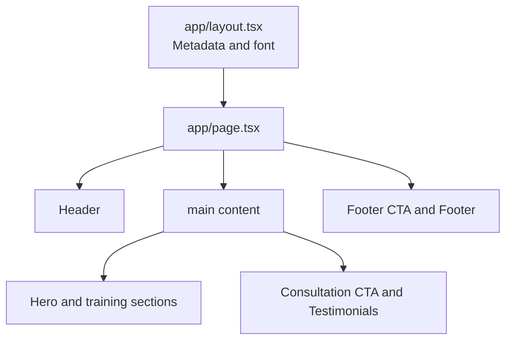

# Tobams Group Training and Development Page

Responsive static page implementation for the Tobams Group frontend intern assessment.

## Links

- Figma reference: [Frontend Intern Assessment](https://www.figma.com/design/wuqCLkK1feTgB6xxSRRwZu/Frontend-Intern-Assessment?node-id=0-1&p=f&t=qxnAKp4Ael8QtLYz-0)
- Live URL: `Add the deployed Vercel URL here before submission`
- Repository: `Add the public GitHub repository URL here before submission`

## Stack

- Next.js 16 with the App Router
- React 19 and TypeScript
- Tailwind CSS 4
- `next/image` for optimized local images
- `next/font` with Nunito
- Lucide React for interface icons

## Setup

Requirements: Node.js 20 or newer and npm.

```bash
npm install
npm run dev
```

Open [http://localhost:3000](http://localhost:3000).

Production checks:

```bash
npm run lint
npm run build
npm start
```

## Architecture

The App Router entry point in `app/page.tsx` composes the page from focused components:



Repeated content is kept as local data arrays in its owning component. Components map over those arrays to keep repeated markup consistent and make content changes safer. Images live in `public/images` and use `next/image`.

## Responsive implementation

The Figma desktop canvas remains `1440px` at the `lg` breakpoint, including existing desktop grids, fixed image dimensions, spacing, and visual treatment. Mobile behavior is added with Tailwind utilities:

- Page shells become `w-full` below `lg` to prevent horizontal overflow.
- Desktop two-column layouts stack into one column on mobile.
- Fixed desktop images become fluid on mobile and restore their Figma dimensions at `lg`.
- Headings, body text, padding, grids, footer columns, and CTA layouts scale for narrow screens.
- Navigation collapses to the existing accessible menu toggle on mobile.

The layout is intended to be checked at 425px, 768px, and 1280px or wider. No custom media queries were added; all responsive behavior uses Tailwind modifiers.

## Accessibility and quality decisions

- Semantic `header`, `nav`, `main`, `section`, `article`, and `footer` elements are used.
- Images have descriptive alternative text.
- Native links and buttons remain keyboard accessible and include focus states where appropriate.
- Decorative SVG icons use `aria-hidden`.
- No UI framework or copied component kit is used.

## Known issues and assumptions
- Navigation and CTA links marked `#` are placeholders because no destination pages were specified.
- The account button is presentational because no account flow was specified.

## AI disclosure

AI coding assistance(Vscode Agent) was used to review the implementation, identify and remove deadcode, and for brainstorming difficult problems.


Arthured by: Enemuor Chidubem.
Email: enemuorchidubem95@gmail.com.
